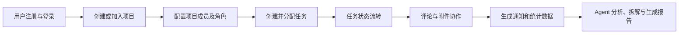
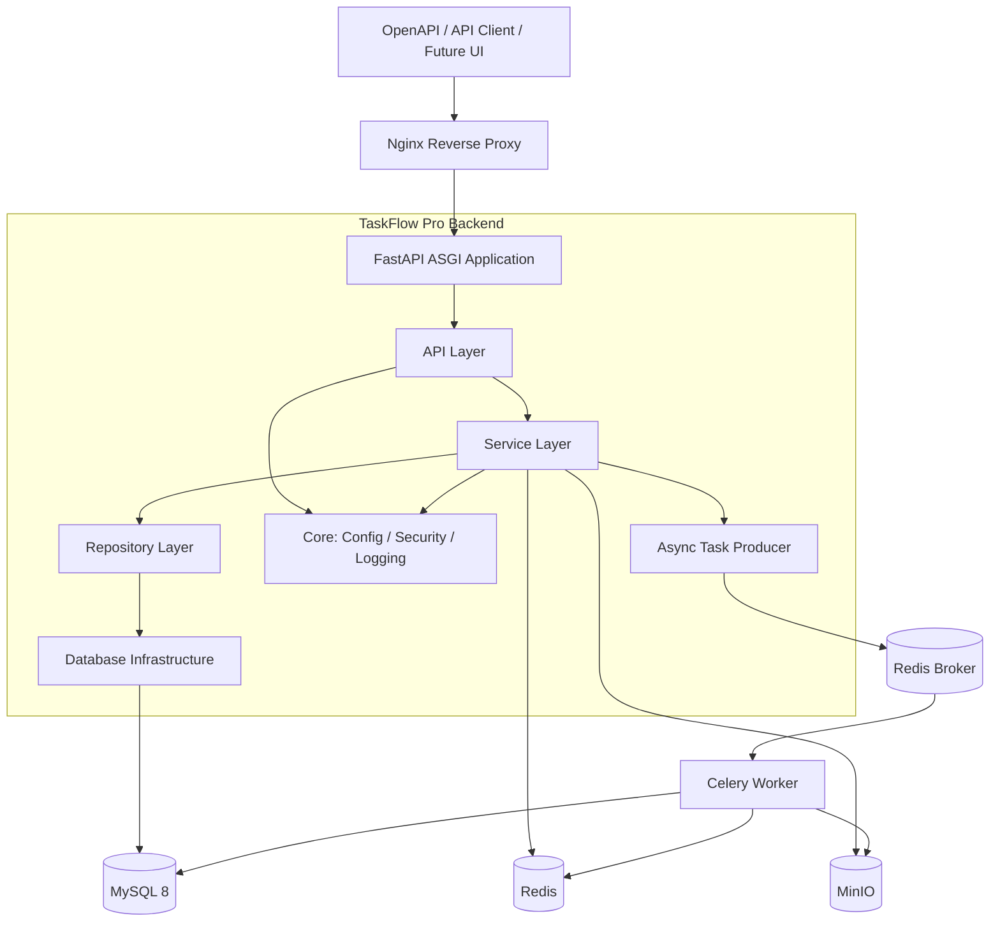
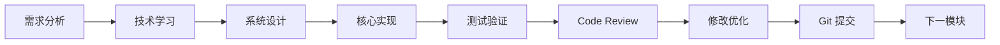
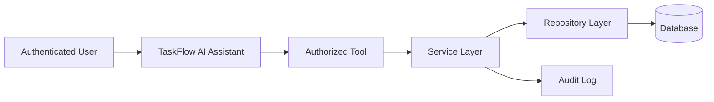

# TaskFlow Pro Backend 企业级 Python 后端项目开发路线与学习规划

> 项目定位：以真实业务为载体，完成一次从需求分析、技术学习、系统设计、编码测试到部署交付的企业级 Python 后端工程训练。

## 1. 文档目的

本文档是 TaskFlow Pro Backend 的项目总纲，用于统一项目目标、技术路线、架构边界、开发阶段、学习方式、Git 流程和验收标准。

本项目不以快速堆叠功能为目标，而以建立可迁移的后端工程能力为目标。完成项目后，开发者不仅要能够运行系统，还要能够解释：

- 为什么选择当前架构；
- 请求如何从 API 层流转到数据库；
- 认证、授权、事务和缓存为什么这样设计；
- 如何发现并处理越权、并发、数据一致性和异步任务问题；
- 如何测试、部署、排查和持续演进系统；
- 如何将现有业务能力安全地封装为 Agent Tool。

## 2. 项目目标与边界

### 2.1 核心目标

1. 系统掌握 FastAPI 企业级后端开发流程。
2. 掌握 SQLAlchemy 2.0 异步数据库访问和事务管理。
3. 掌握认证、RBAC、数据权限和业务规则设计。
4. 掌握 Redis、Celery、MinIO 等后端基础设施。
5. 建立测试、日志、异常处理和容器化部署能力。
6. 形成一个可运行、可测试、可部署、可讲解的秋招项目。
7. 为后续 LLM、Agent 和 Tool Calling 开发建立可靠业务底座。

### 2.2 项目范围

TaskFlow Pro Backend 是一个面向小型团队的企业项目协作与任务管理后端，核心业务包括：

- 用户注册、登录与身份认证；
- 角色、权限与项目数据权限；
- 项目创建与项目成员管理；
- 任务创建、分配和状态流转；
- 任务评论；
- 文件上传与附件管理；
- 站内通知；
- 缓存、异步任务和工程化部署；
- 基于现有业务服务的 Agent 扩展。

### 2.3 非目标

- 不开发正式前端；接口通过 OpenAPI、自动化测试和 API 调试工具验证。
- 不采用微服务，不引入服务发现、分布式事务等超出当前目标的复杂度。
- 不为了“看起来企业级”而机械使用设计模式或增加无实际价值的抽象。
- 不允许 Agent 绕过业务层直接访问数据库。
- 不以复制大量生成代码作为学习方式。

如果核心后端全部完成且时间充足，可以额外生成简单展示前端，但它不属于本项目主线验收范围。

## 3. 项目业务主线

系统围绕以下业务闭环建设：



该主线要求系统不仅完成 CRUD，还要处理真实企业业务中的以下问题：

- 用户是否有权访问目标项目；
- 用户是否有权执行某项操作；
- 任务负责人是否属于当前项目；
- 状态是否允许从当前值转换到目标值；
- 多表写入是否处于正确事务中；
- 重复请求、并发更新和失败重试是否会破坏数据；
- 缓存、数据库和对象存储之间如何保持可接受的一致性。

## 4. 总体架构

### 4.1 架构风格

项目采用 **前后端分离的 API 形态、模块化单体架构和分层设计**。

选择模块化单体的原因：

- 当前业务规模不需要微服务；
- 单体内事务和调试更直接，适合学习核心后端能力；
- 可以通过清晰模块边界获得良好可维护性；
- 后续确有独立扩缩容或组织边界需求时，再评估服务拆分。

模块化单体不是把全部逻辑写在一起，而是在一个部署单元内保持清晰的领域边界、职责分工和依赖方向。

### 4.2 系统架构图



### 4.3 分层职责

| 层级 | 核心职责 | 不应承担的职责 |
|---|---|---|
| API Layer | 路由、依赖解析、请求校验、调用 Service、构造 HTTP 响应 | 复杂业务决策、直接拼装数据库查询、随意提交事务 |
| Service Layer | 业务规则、用例编排、权限判断、事务边界 | 处理 HTTP 细节、依赖具体请求对象 |
| Repository Layer | 数据查询、持久化、封装 ORM 访问 | 决定业务权限、控制完整业务流程 |
| Model Layer | 表结构、字段、约束、关联关系 | 作为对外请求或响应模型直接暴露 |
| Schema Layer | 请求、响应和内部数据结构校验 | 承担持久化行为 |
| Core / Infrastructure | 配置、安全、日志、数据库、Redis、第三方客户端等基础能力 | 实现具体项目或任务业务规则 |

标准依赖方向：

```text
API → Service → Repository → Database
```

上层可以依赖下层提供的能力，下层不应反向依赖 HTTP API。对于过于简单且没有复用价值的查询，不为了形式强制制造复杂抽象；所有分层都必须服务于职责清晰、可测试性和可维护性。

### 4.4 推荐目录结构

```text
backend/
├── app/
│   ├── api/
│   ├── core/
│   ├── database/
│   ├── models/
│   ├── repositories/
│   ├── schemas/
│   ├── services/
│   ├── tasks/
│   ├── utils/
│   └── main.py
├── alembic/
├── docs/
│   ├── design/
│   └── learning/
├── tests/
├── .env.example
├── README.md
└── requirements.txt
```

该结构是初始建议，不是不可修改的模板。Phase 0 会讨论按技术层组织与按业务模块组织的差异，再根据项目规模确定最终目录，并记录架构决策。

## 5. 技术路线

| 领域 | 技术 | 项目用途 | 重点学习内容 |
|---|---|---|---|
| 编程语言 | Python 3.11 | 后端业务与基础设施开发 | 类型标注、包与模块、异常、上下文管理器、异步编程 |
| Web 框架 | FastAPI | REST API、依赖注入、OpenAPI | 请求生命周期、Router、Depends、生命周期管理 |
| 数据校验 | Pydantic v2 | 请求、响应和配置校验 | Schema 边界、序列化、验证器、Settings |
| ASGI Server | Uvicorn | 承载 FastAPI 应用 | ASGI、事件循环、并发模型、开发与生产启动差异 |
| ORM | SQLAlchemy 2.0 | 数据建模与异步访问 | Declarative Mapping、AsyncSession、关系、查询与事务 |
| 数据迁移 | Alembic | 数据库结构演进 | revision、upgrade、downgrade、迁移审查 |
| 数据库 | MySQL 8 | 保存核心业务数据 | 表设计、索引、约束、事务、锁、执行计划 |
| 认证 | JWT | 用户身份认证 | 密码哈希、Token 签发校验、过期与主动失效 |
| 授权 | RBAC + 数据权限 | 控制功能和资源访问 | 角色权限、项目成员关系、最小权限、防越权 |
| 缓存 | Redis | 热点缓存、权限缓存、会话控制 | 数据结构、TTL、Cache Aside、一致性和降级 |
| 异步任务 | Celery | 通知、邮件、统计和 AI 任务 | Broker、Worker、重试、幂等、超时、可观测性 |
| 对象存储 | MinIO | 项目和任务附件 | 元数据、对象 Key、权限、预签名 URL、一致性 |
| 测试 | pytest | 单元、集成和 API 测试 | fixture、异步测试、数据库隔离、Mock 边界 |
| 部署 | Docker Compose | 编排完整运行环境 | 镜像、网络、卷、健康检查、配置与迁移 |
| 网关 | Nginx | 反向代理和入口管理 | 请求转发、超时、上传限制、基础安全配置 |
| AI 扩展 | LLM / Agent / Tool Calling | 项目分析、任务拆解、周报生成 | Tool Schema、权限透传、审计、结构化输出 |

## 6. 学习方法与文档规范

### 6.1 项目驱动学习闭环

每个模块按照同一流程推进：



任何模块都不能以“接口返回 200”作为完成标准。必须同时验证业务规则、权限边界、异常路径和数据一致性。

### 6.2 技术学习文档模板

所有学习内容保存到 `docs/learning/`，每个核心技术点采用以下结构：

```text
# 技术名称

## 1. 背景
为什么出现，解决什么问题？

## 2. 核心思想
该技术的本质和设计思想是什么？

## 3. 工作原理
内部执行流程和关键机制是什么？

## 4. 企业实践
真实项目如何使用，有哪些边界、取舍和常见问题？

## 5. TaskFlow 应用
该技术在本项目什么位置使用，采用什么方案？

## 6. 开发要求
完成对应模块前必须能够解释、设计和实现哪些内容？
```

技术学习的完成标准不是记住 API，而是能够独立完成对应设计、实现、测试和问题定位。

### 6.3 系统设计文档要求

每个业务模块在 `docs/design/` 中形成设计文档，至少包含：

- 需求范围与非目标；
- 参与者、用例和业务规则；
- 正常流程与异常流程；
- 数据库表、字段、约束、关联和索引；
- API 路径、方法、输入、输出和状态码；
- 功能权限与数据权限；
- 事务边界和一致性策略；
- 异常类型与错误响应；
- 测试场景与验收标准；
- 关键设计取舍。

设计通过后才进入核心编码，避免一边堆代码一边猜业务规则。

## 7. 开发阶段规划

### Phase 0：企业级 Python 项目初始化

#### 学习内容

- Python 包、模块和导入机制；
- 虚拟环境与依赖隔离；
- 依赖声明与版本管理；
- 配置管理和环境变量；
- `.env` 与 `.env.example` 的职责；
- ASGI 协议与 Uvicorn；
- FastAPI 应用生命周期；
- `async/await`、事件循环、I/O 密集与阻塞调用；
- 企业项目目录与依赖方向；
- Git、分支和 Conventional Commits。

#### 项目产出

- 初始化 Git 仓库和分支；
- 确定项目目录结构；
- 最小可运行的 FastAPI 应用；
- 健康检查接口；
- 配置骨架和 `.env.example`；
- README 初稿；
- Phase 0 学习与设计文档。

#### 阶段验收

- 能解释 FastAPI、Uvicorn 与 ASGI 的职责边界；
- 能解释异步适用场景，以及为什么阻塞 I/O 会阻塞事件循环；
- 能说明配置为何不能散落在代码或提交到仓库；
- 能从零创建、启动并说明项目结构；
- 完成首次提交：`chore: initialize project structure`。

### Phase 1：FastAPI 与 API 工程基础

#### 学习内容

- HTTP 请求、响应、状态码与幂等语义；
- REST API 资源设计；
- FastAPI Router 和 API 版本管理；
- Pydantic v2 请求校验和响应序列化；
- Dependency Injection 与控制反转；
- FastAPI 依赖树解析、缓存和 `yield` 依赖；
- 统一异常响应与 OpenAPI 文档。

#### 对应项目能力

- 建立 `/api/v1` 路由体系；
- 建立请求、响应和异常约定；
- 建立可复用依赖；
- 通过 API 文档验证基础请求链路。

#### 阶段验收

- 能描述一次请求从 Uvicorn 到路由函数再到响应的完整流程；
- 能独立设计基础 REST API；
- 能解释依赖注入如何用于 Session、当前用户和权限认证；
- 能区分输入 Schema、输出 Schema 与 ORM Model。

### Phase 2：MySQL、SQLAlchemy 2.0 与 Alembic

#### 学习内容

- 关系模型、范式与反范式的取舍；
- 主键、外键、唯一约束、检查约束和索引；
- SQLAlchemy 2.0 Declarative Mapping；
- AsyncEngine、连接池和 AsyncSession；
- Unit of Work、identity map、flush、commit 与 rollback；
- 一对多、多对多和关联实体；
- 懒加载、预加载与 N+1 问题；
- Alembic 迁移生成、审查和回滚。

#### 对应项目能力

- 接入 MySQL 8 异步访问；
- 建立 Session 生命周期管理；
- 设计用户、角色、权限、项目、成员、任务、评论、通知和文件等核心表；
- 建立初始迁移和数据库初始化流程；
- 建立 Repository 基础约定。

#### 阶段验收

- 能解释 Session 不是数据库连接本身；
- 能判断事务应该由哪一层控制；
- 能通过约束和索引保护数据并优化查询；
- 能从空数据库执行迁移并得到预期结构；
- 能识别并修复基础 N+1 查询问题。

### Phase 3：用户认证

#### 学习内容

- 认证与授权的区别；
- 密码哈希、盐和安全存储；
- JWT Header、Payload、Signature；
- Access Token 生命周期和时钟问题；
- Token 校验、过期、撤销和主动失效；
- FastAPI 安全依赖和当前用户解析；
- 登录安全、错误信息和敏感数据保护。

#### 对应项目功能

- 用户注册；
- 用户登录；
- JWT 签发和验证；
- 获取当前用户信息；
- 基础账户状态校验。

#### 阶段验收

- 密码不可逆存储且不会出现在响应和日志中；
- 无效、过期、伪造 Token 均被正确拒绝；
- 能解释 JWT 的无状态优势和主动失效难题；
- 主流程、重复注册、错误密码和禁用用户等场景有测试。

### Phase 4：RBAC 与数据权限

#### 学习内容

- RBAC0 及角色、权限、用户关系；
- 系统角色与项目角色；
- 功能权限与数据权限；
- 最小权限原则；
- 权限依赖、策略组合和权限矩阵；
- 水平越权与垂直越权；
- 权限缓存和失效策略。

#### 对应项目功能

- Admin、Manager、Member 角色模型；
- 角色与权限绑定；
- 项目成员角色；
- 接口操作权限校验；
- 项目资源范围校验。

#### 阶段验收

- 不能仅依赖角色名称完成授权；
- 能同时校验“是否允许执行该操作”和“是否允许操作该资源”；
- 权限矩阵覆盖核心接口；
- 跨项目访问、普通成员提权等越权场景有测试；
- 能解释修改权限后缓存如何失效。

### Phase 5：项目、任务、评论、文件与通知

#### 学习内容

- 业务用例与领域规则；
- Service 编排和 Repository 查询职责；
- 项目成员关联实体；
- 多表事务和失败回滚；
- 任务状态机；
- 分页、过滤、排序和查询优化；
- 幂等性和并发更新；
- 文件元数据与对象内容分离；
- 业务事件和通知模型。

#### 对应项目功能

- 创建、查询、修改和归档项目；
- 添加、移除项目成员并修改其角色；
- 创建、修改、分配和查询任务；
- TODO、DOING、DONE 状态流转；
- 创建与查询任务评论；
- 上传、下载和删除附件；
- 创建、查询和标记站内通知。

#### 关键业务约束

- 项目创建者自动成为负责人；
- 非项目成员不可读取项目数据；
- 任务负责人必须是项目成员；
- 状态只能按照定义的规则流转；
- 项目负责人不可被普通成员移除；
- 删除或归档项目时必须明确关联数据策略；
- 文件二进制内容与数据库元数据分开保存；
- 重复请求和并发更新不得静默破坏数据。

#### 阶段验收

- 完整业务闭环可以通过 API 和测试运行；
- 权限与异常分支有明确行为；
- 跨表操作具备可靠事务边界；
- 任务状态转换规则集中且可测试；
- 列表接口具备分页、过滤和必要索引；
- 发布 V1.0 核心业务版本。

### Phase 6：工程化增强

#### 学习内容

- Redis 数据结构、TTL 和 Cache Aside；
- 缓存穿透、击穿、雪崩及数据一致性；
- Celery Broker、Worker、重试、超时和幂等；
- MinIO 对象管理和预签名 URL；
- 统一异常体系和结构化日志；
- pytest fixture、异步测试和测试隔离；
- Dockerfile、Docker Compose、网络、卷和健康检查；
- Nginx 反向代理、上传限制和超时；
- 配置分层、密钥管理和生产环境差异。

#### 对应项目能力

- 缓存热点用户或项目数据；
- 缓存权限结果并设计主动失效；
- 管理 Token 黑名单、会话版本或 Refresh Token 状态；
- 异步执行通知、邮件、统计和清理任务；
- 使用 MinIO 完善附件存储；
- 建立统一错误响应、Request ID 和日志；
- 完成单元、集成和 API 测试体系；
- 使用 Docker Compose 启动完整依赖；
- 通过 Nginx 暴露服务入口。

#### 阶段验收

- Redis 故障时核心业务具备明确降级行为；
- Celery 任务重试不会产生重复业务结果；
- 日志不记录密码、Token 等敏感信息；
- 关键流程、权限边界和失败路径具备自动化测试；
- 新环境可以按照 README 完成启动和迁移；
- 所有容器具备合理健康检查和持久化配置；
- 发布 V2.0 工程增强版本。

### Phase 7：TaskFlow AI Assistant

#### 学习内容

- LLM、Workflow 与 Agent 的区别；
- Tool Calling 和结构化 Schema；
- Tool 的最小权限、输入校验和输出约束；
- 用户身份和权限上下文透传；
- Prompt Injection、数据泄露和越权风险；
- 人工确认、操作审计和可追溯性；
- 长耗时 AI 任务与 Celery 集成；
- AI 输出评估与失败降级。

#### 架构约束

Agent 必须复用已有业务边界：



禁止以下调用方式：

```text
Agent → Database
```

#### 对应项目功能

- 项目风险分析 Agent；
- 需求任务拆解 Agent；
- Markdown 周报生成 Agent；
- Project Tool、Task Tool、Statistics Tool；
- Agent 调用审计和敏感操作确认。

#### 阶段验收

- Tool 输入输出具备明确 Schema；
- Agent 操作受到与普通 API 一致的权限约束；
- 写操作经过业务校验，必要时要求人工确认；
- 每次调用可以审计用户、工具、参数摘要、结果和时间；
- AI 失败不会破坏核心业务数据；
- 发布 V3.0 Agent 扩展版本。

## 8. 版本与里程碑

| 里程碑 | 主要结果 | 能力证明 |
|---|---|---|
| M0 | 项目初始化 | Python 工程、配置、ASGI、Git 基础 |
| M1 | API 与数据库底座 | FastAPI、Pydantic、SQLAlchemy、Alembic |
| M2 | 用户认证 | 密码安全、JWT、安全依赖 |
| M3 | RBAC | 角色权限、数据权限、防越权 |
| M4 | V1.0 核心业务闭环 | 业务建模、事务、状态机、附件和通知 |
| M5 | V2.0 工程增强 | Redis、Celery、测试、日志、容器化部署 |
| M6 | V3.0 AI Assistant | Agent Tool、权限透传、审计和安全控制 |

建议按照学习质量推进，不把时间估算当作硬性进度。每个阶段只有在达到验收标准后才能进入下一阶段。

## 9. Git 与 GitHub 开发规范

### 9.1 分支模型

| 分支 | 用途 |
|---|---|
| `main` | 稳定、可发布版本，只接收经过验证的合并 |
| `develop` | 日常集成分支 |
| `feature/*` | 单一功能或模块开发，如 `feature/auth` |

必要时可以使用 `fix/*`、`refactor/*`、`docs/*`，但不创建没有实际价值的长期分支。

### 9.2 标准开发流程

1. 从 `develop` 创建边界清晰的功能分支。
2. 在 `docs/learning/` 完成必要技术学习。
3. 在 `docs/design/` 完成模块设计。
4. 小步实现核心功能和测试。
5. 执行格式化、静态检查和自动化测试。
6. 自查差异，确认没有密钥、临时文件和无关改动。
7. 提交并推送功能分支。
8. 创建 Pull Request 合并到 `develop`。
9. 完成 Code Review 和修改。
10. 版本验收后由 `develop` 合并到 `main` 并创建版本标签。

### 9.3 Conventional Commits

提交格式：

```text
type(scope): description
```

常用类型：

| 类型 | 用途 |
|---|---|
| `feat` | 新增功能 |
| `fix` | 修复缺陷 |
| `refactor` | 不改变外部行为的重构 |
| `test` | 新增或调整测试 |
| `docs` | 文档变更 |
| `chore` | 工程配置和维护任务 |
| `perf` | 性能优化 |
| `ci` | 持续集成配置 |

示例：

```text
chore: initialize project structure
feat(auth): implement user registration
feat(task): add task status workflow
fix(rbac): prevent cross-project access
test(task): cover invalid status transitions
docs: update architecture decisions
```

### 9.4 提交原则

- 一个提交表达一个清晰意图；
- 避免把整个模块压缩为一个巨大提交；
- 不提交 `.env`、密码、Token、私钥和生产配置；
- 数据库迁移文件必须进入版本控制；
- 提交前检查改动范围和测试结果；
- 提交信息说明“改了什么”，设计文档说明“为什么这样改”。

## 10. 人与 AI 的协作边界

### 10.1 学习者负责

- 复述需求和关键业务规则；
- 参与并解释数据库和 API 设计；
- 编写核心 Service、权限和事务逻辑；
- 为关键业务路径编写测试；
- 根据 Review 亲自修改代码；
- 分析报错原因并总结；
- 对最终实现负责。

### 10.2 AI 导师负责

- 系统讲解技术背景、原理和企业实践；
- 通过问题检查理解程度；
- 对设计方案提出边界条件和风险；
- 提供少量脚手架、配置和重复性辅助代码；
- 协助 Debug，但解释问题根因；
- 进行 Code Review；
- 帮助补充测试场景和优化方向。

### 10.3 每个模块的协作流程

```text
AI 给出需求场景和学习材料
→ 学习者复述理解并完成设计练习
→ 双方确认系统设计
→ 学习者编写核心代码
→ AI Review 并说明问题原因
→ 学习者修改和补测试
→ 验收通过后提交 Git
```

不得用整段生成代码跳过理解、设计和调试过程。AI 给出的任何实现都需要学习者能够解释后才能合入项目。

## 11. 模块完成标准 Definition of Done

一个模块只有同时满足以下条件才算完成：

- 需求范围、业务规则和非目标明确；
- 学习文档和设计文档完成；
- 数据库约束和索引经过说明；
- API 输入、输出、状态码和错误行为稳定；
- 功能权限和数据权限得到验证；
- 事务边界和失败回滚行为明确；
- 正常流程、失败流程和越权场景有测试；
- 数据库变化具备可执行的 Alembic 迁移；
- 日志不存在敏感数据泄露；
- 代码通过约定的质量检查；
- README 或相关文档同步更新；
- 学习者能够独立解释设计、实现与取舍；
- 已完成符合规范的 Git 提交和 Review。

## 12. 质量与安全基线

项目从第一天开始遵守以下基线，而不是在结束时集中补救：

- 所有输入在可信边界进行校验；
- 密码只保存安全哈希，不记录明文；
- Token、密钥和连接信息由环境变量管理；
- 所有资源接口同时考虑身份、功能权限和数据权限；
- 数据完整性同时依靠业务校验和数据库约束；
- 多步写操作明确事务边界；
- 列表接口默认分页；
- 外部服务调用设置超时并处理失败；
- 异步任务按可能重复执行进行幂等设计；
- 日志具有 Request ID 且对敏感信息脱敏；
- 核心业务不因 Redis、Celery 或 AI 暂时不可用而无条件失效；
- 任何 AI 写操作都经过鉴权、校验和审计。

## 13. 最终交付物

项目完成时应包含：

- 可运行的 TaskFlow Pro Backend 源代码；
- 完整且可重复执行的 Alembic 迁移；
- `docs/learning/` 技术学习文档；
- `docs/design/` 模块设计文档；
- OpenAPI 接口文档；
- 权限矩阵和数据库 ER 图；
- pytest 自动化测试；
- Dockerfile、Docker Compose 和 Nginx 配置；
- 环境变量示例与部署说明；
- 清晰的 Git 历史、Pull Request 记录和版本标签；
- TaskFlow AI Assistant 及其 Tool、权限和审计设计；
- 项目完成后统一整理的简历描述、项目亮点和面试表达。

简历内容只描述已经实现、测试并能够解释的能力，不提前包装尚未完成的功能。

## 14. 下一步

总规划确认后进入 Phase 0，但不会立即生成完整项目代码。Phase 0 的顺序为：

1. 生成 `docs/learning/phase-0-project-initialization.md`；
2. 学习 Python 工程结构、环境隔离、配置、ASGI、Uvicorn、生命周期和 Git；
3. 完成理解检查与目录设计；
4. 由学习者创建或确认核心结构；
5. AI 辅助补充最小配置并进行 Review；
6. 启动最小 FastAPI 应用并验证；
7. 完成首次规范提交。

在 Phase 0 验收完成前，不进入用户认证、RBAC 或其他业务模块。
